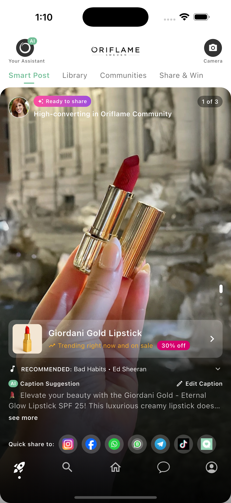

# Smart Post — Flutter Implementation

A single-screen Flutter UI built from the Oriflame *Smart Posts* Figma design: a
reels-style feed of AI-generated social posts, each with a product block, a
suggested track, an editable caption and a quick-share strip — plus the
AI-generation launch screen and the share flow from the prototype.

All data is hardcoded. There is no backend, API layer or URL launcher — per the
brief, this is a UI build meant to be demoed.



---

## Running it

```bash
flutter pub get
flutter run
```

Built against **Flutter 3.38 / Dart 3.x**.

```bash
flutter test       # widget smoke tests
flutter analyze    # clean — no issues
```

---

## What's implemented

The canvas annotations were treated as the spec:

| Design note / prototype step | Where it lives |
|---|---|
| "Show 3 posts — scroll like reels" | `smart_post/widgets/post_feed.dart` — vertical snapping `PageView` |
| Full-bleed photo with the nav floating over it | `smart_post_screen.dart` + `shared/widgets/bottom_nav_bar.dart` |
| "Product info fades in from the bottom after 3 s" | `post_detail_panel.dart` — slide + scale + fade, only on the visible card |
| "This whole box is clickable → personal beauty store" | `product_card.dart` |
| "This list is scrollable" | `quick_share_row.dart` — horizontal brand buttons |
| "Open this page when the caption is tapped" | `caption_block.dart` → `edit_caption_screen.dart` |
| "Open the keyboard to edit" | editor field autofocuses on push |
| "Enable Save when a change is made" | `save_button.dart`, driven by a dirty flag |
| App-launch generation screen | `generation/` — typewriter status lines over a drifting S-shaped gradient |
| Share flow (tap a platform) | `share/` — blurred card, Oriflame spinner, progress bar, then an "Opening <brand>…" splash |

---

## Architecture

```
lib/
├── main.dart                  entry point — runApp()
├── app.dart                   MaterialApp, theme, provider scope, routes
├── core/
│   ├── theme/                 colours, typography, spacing/sizes, ThemeData
│   ├── constants/             every string and asset path
│   └── utils/                 responsive scaling helpers
├── data/
│   ├── models/                SmartPost, Product, MusicTrack, SharePlatform
│   └── mock/                  the hardcoded posts and share destinations
├── features/
│   ├── smart_post/            feed screen + controller + widgets
│   ├── generation/            the AI-generation launch screen
│   ├── edit_caption/          full-screen caption editor
│   └── share/                 the quick-share flow (card + spinner)
├── shared/widgets/            widgets used by more than one feature
└── routes/                    named route table
```

Three rules hold the structure together:

1. **One widget per file.** No file declares two public widgets.
2. **No literals in widget files.** Colours come from `AppColors`, sizes from
   `AppSpacing`/`AppSizes`, copy from `AppStrings`. A bare `16` or `#FFF` in a
   widget belongs in `core/theme`.
3. **`features/` is private, `shared/` is public.** A widget moves up to
   `shared/` the moment a second feature needs it (e.g. `AiBadge`, `AppImage`,
   `TagChip`, `BottomNavBar`).

**State** is a single `ChangeNotifier` (`SmartPostController`) exposed through
`provider`. For one screen with a handful of fields, anything heavier would be
ceremony — and swapping it out later touches only that one file.

---

## Assumptions and decisions

Where the design left a behaviour undefined, these are the calls I made:

- **Share icons.** The strip renders pre-styled brand buttons from
  `assets/icons/`, each clipped into a uniform translucent circle. If an image
  is missing it falls back to a brand-coloured circle with a Material icon.
- **Bottom navigation.** Five unlabelled icons float over the photo (white,
  active tinted brand-white with a dot marker), matching the "Ready for dev"
  frame. The Discover icon uses `assets/icons/rocket.png`.
- **Product block vs. price.** Later frames show a trending line where earlier
  frames show a price. `ProductCard` shows the trending line when the product is
  trending and the price otherwise, with the discount pill appended in both.
- **Caption.** "see more" expands the caption in place (so the user keeps their
  place in the feed); tapping the caption body opens the editor. The referral
  code and link render as their own italic lines, and the label carries the AI
  badge as "Caption Suggestion".
- **Share action.** No real share sheet or deep link (UI-only brief). Tapping a
  platform runs the prototype's loading card, then an "Opening <brand>…" splash,
  then a confirmation snackbar.
- **Added states.** A discard-changes dialog when leaving the editor dirty; a
  confirmation snackbar after saving; snackbars standing in for the camera,
  assistant and music actions so every control does something in a demo.
- **Timings.** The design specifies only the 3-second product reveal; the
  generation typewriter and share-flow cadences are tuned to read comfortably.
  All motion respects the OS reduce-motion setting.

---

## Responsiveness and accessibility

- Sizes are scaled against the 375×812 design frame and clamped between 0.85×
  and 1.30× so the layout holds on small handsets without ballooning on tablets.
- Above 600 pt the feed keeps a centred 480 pt column instead of stretching a
  portrait photo across the viewport.
- Text scaling is capped at 1.3× on the feed — the card is dense and unbounded
  scaling overflows it.
- The 3-second reveal and both loading screens respect reduce-motion.
- Interactive elements carry semantic labels; share buttons carry tooltips.

---

## Assets and typography

Real post photos, product shots, the avatar and the brand buttons live in
`assets/images/` and `assets/icons/`; paths are centralised in
`core/constants/app_assets.dart`. Every photo loads through `AppImage`
(`shared/widgets/app_image.dart`), which draws a branded gradient placeholder if
a file is missing, so the app always builds and demos.

The design is set in **Satoshi**, which is licensed and not redistributable, so
the font declaration is commented out in `pubspec.yaml` and
`AppTypography.fontFamily` is `null` — the app falls back to the platform sans
with no layout impact. Add the `.otf` files to `assets/fonts/Satoshi/`,
uncomment the block and set `fontFamily = 'Satoshi'` for exact fidelity.

---

## Not built

Real sharing, a music picker, product deep links, authentication, a network
layer, and dark mode — none are in the design or the brief.
